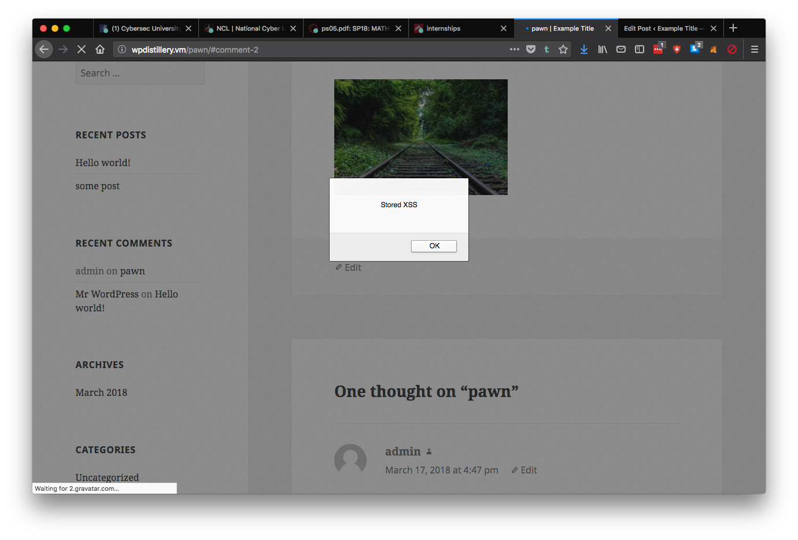
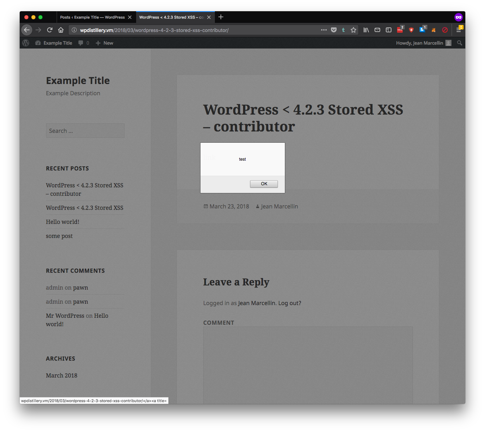
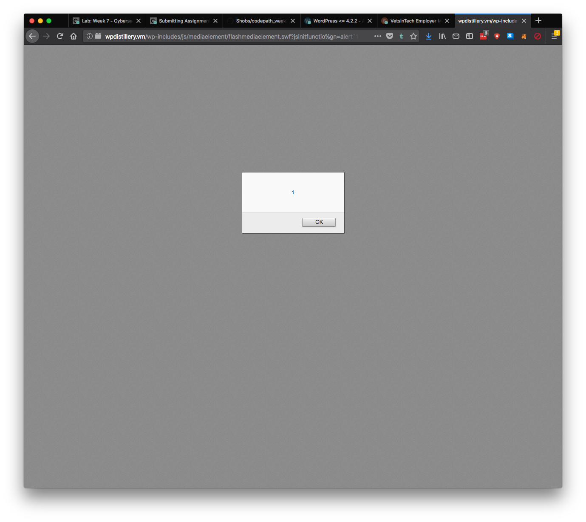

# codepath_week7
Wordpress vulnerability testing

EXPLOIT #1 -- Unauthenticated Stored Cross-Site Scripting (XSS)
------------------------------------------------------------
VULNERABILITY:
WordPress <= 4.2 - Unauthenticated Stored Cross-Site Scripting (XSS)
https://wpvulndb.com/vulnerabilities/7945
https://klikki.fi/adv/wordpress2.html

AFFECTED WP:
4.2     fixed in version 4.2.1
4.1.2   fixed in version 4.2.1
4.1.1   fixed in version 4.2.1
3.9.3   fixed in version 4.2.1

CLASSIFICATION:
Type            XSS
OWASP Top 10    A3: Cross-Site Scripting (XSS)
CWE             CWE-79

DETAILS:
Allows a user to write html and javascript in a comment and have it executed remotely every time the page loads.

  was used in this instance.

IMAGES:

------------------------------------------------------------

EXPLOIT #2 -- Authenticated Stored Cross-Site Scripting (XSS)
------------------------------------------------------------
VULNERABILITY:
WordPress <= 4.2.2 - Authenticated Stored Cross-Site Scripting (XSS)
https://wpvulndb.com/vulnerabilities/8111
https://klikki.fi/adv/wordpress3.html

AFFECTED WP:

4.2.2   fixed in version 4.2.3
4.2.1   fixed in version 4.2.3
4.2     fixed in version 4.2.3
4.1.5   fixed in version 4.1.6
4.1.4   fixed in version 4.1.6
4.1.3   fixed in version 4.1.6
4.1.2   fixed in version 4.1.6
4.1.1   fixed in version 4.1.6
4.1     fixed in version 4.1.6
4.0.5   fixed in version 4.0.6
4.0.4   fixed in version 4.0.6
4.0.3   fixed in version 4.0.6
4.0.2   fixed in version 4.0.6
4.0.1   fixed in version 4.0.6
4.0     fixed in version 4.0.6
3.9.6   fixed in version 3.9.7
3.9.5   fixed in version 3.9.7
3.9.4   fixed in version 3.9.7
3.9.3   fixed in version 3.9.7
3.9.2   fixed in version 3.9.7
3.9.1   fixed in version 3.9.7
3.9     fixed in version 3.9.7
3.8.8   fixed in version 3.8.9
3.8.7   fixed in version 3.8.9
3.8.6   fixed in version 3.8.9
3.8.5   fixed in version 3.8.9
3.8.4   fixed in version 3.8.9
3.8.3   fixed in version 3.8.9
3.8.2   fixed in version 3.8.9
3.8.1   fixed in version 3.8.9
3.8     fixed in version 3.8.9
3.7.8   fixed in version 3.7.9
3.7.7   fixed in version 3.7.9
3.7.6   fixed in version 3.7.9
3.7.5   fixed in version 3.7.9
3.7.4   fixed in version 3.7.9
3.7.1   fixed in version 3.7.9
3.7     fixed in version 3.7.9
3.6.1   fixed in version 4.2.3
3.6     fixed in version 4.2.3
3.5.2   fixed in version 4.2.3
3.5.1   fixed in version 4.2.3
3.5     fixed in version 4.2.3
3.4.2   fixed in version 4.2.3
3.4.1   fixed in version 4.2.3
3.4     fixed in version 4.2.3
3.3.3   fixed in version 4.2.3
3.3.2   fixed in version 4.2.3
3.3.1   fixed in version 4.2.3
3.3     fixed in version 4.2.3
3.2.1   fixed in version 4.2.3
3.2     fixed in version 4.2.3
3.1.4   fixed in version 4.2.3
3.1.3   fixed in version 4.2.3
3.1.2   fixed in version 4.2.3
3.1.1   fixed in version 4.2.3
3.1     fixed in version 4.2.3
3.0.6   fixed in version 4.2.3
3.0.5   fixed in version 4.2.3
3.0.4   fixed in version 4.2.3
3.0.3   fixed in version 4.2.3
3.0.2   fixed in version 4.2.3
3.0.1   fixed in version 4.2.3
3.0     fixed in version 4.2.3

CLASSIFICATION:
Type            XSS
OWASP Top 10    A3: Cross-Site Scripting (XSS)
CWE             CWE-79

DETAILS:
Under default configuration, the attack requires a Contributor or Author level account. The attacker would insert specially formatted HTML containing JavaScript on a WordPress page or post. Some special configurations may allow posting or editing page content for unauthenticated users. 

I created a contributor account and created a post where I placed the following script under the text input mode:

<a href="[caption code=">]</a><a title=" onmouseover=alert('test')  ">link</a>

Once post approved and published by admin, the page contained and XSS

IMAGES:

------------------------------------------------------------

------------------------------------------------------------

EXPLOIT #3 -- MediaElement.js Reflected Cross-Site Scripting (XSS)
------------------------------------------------------------
VULNERABILITY:
WordPress 4.2-4.5.1 - MediaElement.js Reflected Cross-Site Scripting (XSS)
https://wordpress.org/news/2016/05/wordpress-4-5-2/
https://gist.github.com/cure53/df34ea68c26441f3ae98f821ba1feb9c

AFFECTED WP:

4.5.1   fixed in version 4.5.2
4.5     fixed in version 4.5.2
4.4.2   fixed in version 4.5.2
4.4.1   fixed in version 4.5.2
4.4     fixed in version 4.5.2
4.3.3   fixed in version 4.5.2
4.3.2   fixed in version 4.5.2
4.3.1   fixed in version 4.5.2
4.3     fixed in version 4.5.2
4.2.7   fixed in version 4.5.2
4.2.6   fixed in version 4.5.2
4.2.5   fixed in version 4.5.2
4.2.4   fixed in version 4.5.2
4.2.3   fixed in version 4.5.2
4.2.2   fixed in version 4.5.2
4.2.1   fixed in version 4.5.2
4.2     fixed in version 4.5.2

CLASSIFICATION:
Type            XSS
OWASP Top 10    A3: Cross-Site Scripting (XSS)
CWE             CWE-79

DETAILS:
WordPress 4.5.1 is vulnerable against a reflected XSS that stems from an insecure URL sanitization process performed in the file flashmediaelement.swf. The code in the file attempts to remove flashVars ¹ in case they have been set GET parameters but fails to do so, enabling XSS via ExternalInterface ².

Use the following POC link on any word press site and it will execute js code on the user machine.

https://wpdistillery.vm/wp-includes/js/mediaelement/flashmediaelement.swf?jsinitfunctio%gn=alert`1`

IMAGES:

------------------------------------------------------------

